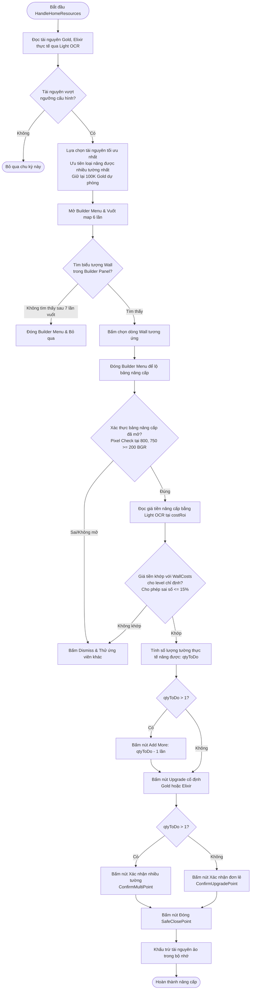

# Kế hoạch Nâng cấp Thuật toán Wall Upgrade — CV-AUT

> **Mục tiêu**: Loại bỏ hoàn toàn thư mục `walls/` chứa các tệp asset ảnh tường (đặc biệt là `verify_wall_level.png`),
> đồng thời tích hợp khả năng nâng cấp hàng loạt (bulk upgrade) và quản lý tài nguyên thông minh —
> lấy cảm hứng từ dự án NX-ClashClient (Python) nhưng giữ nguyên kiến trúc siêu nhẹ của C#, dự án nằm ở "E:\Projects\CV-AUT\Legacy\NX-ClashClient"
>
> **Độ phân giải mục tiêu**: 1600×900 pixel (ADB)

---

## 1. Sơ đồ Luồng hoạt động (Mermaid Workflow)



---

## 2. Phân tích Ảnh hưởng (GitNexus Impact Analysis)

Trước khi thực hiện bất kỳ chỉnh sửa nào trong file [WallUpdater.cs](file:///e:/Projects/CV-AUT/src/Simplimixi/Backend/Core/WallUpdater.cs), AI Agent **bắt buộc** phải chạy phân tích ảnh hưởng (blast radius) đối với các biểu tượng (symbols) sau:

1. `WallUpdater`: Lớp điều khiển chính.
2. `HandleHomeResources(int wallLevel, int wallGoldThreshold, int wallElixirThreshold)`: Điểm vào (Entry point) được gọi từ bên ngoài.
3. `UpgradeWall(string resource, int wallLevel)`: Phương thức thực hiện nâng cấp (sẽ được đổi tên hoặc cấu trúc lại thành `UpgradeWallBulk`).
4. `ValidateWallTap(int wallLevel)`: Phương thức xác thực (sẽ được thay thế bằng `ValidateWallTapNew`).

### Phân tích Callers (Upstream)
* `HandleHomeResources` được gọi bởi `BotService.cs` hoặc các lớp điều phối tự động khác để quản lý chu kỳ kiểm tra nhà chính. Cần đảm bảo kiểu trả về (`int` - số lượng tường đã nâng cấp thành công) được bảo toàn hoặc xử lý nhất quán.

### Kết quả chạy GitNexus Impact Analysis (2026-06-11)

Lệnh chuẩn bị:
* `npx gitnexus status` → index repo `CV-AUT` đang up-to-date tại commit `64fd294`.
* Do máy có nhiều repo đã index, các lệnh impact phải truyền `--repo CV-AUT`.

Kết quả upstream blast radius:

| Symbol | Risk | Direct callers/importers | Affected processes chính | Ghi chú triển khai |
| --- | --- | --- | --- | --- |
| `WallUpdater` | LOW | `CVAutomationFramework.CVAutomationFramework`, `WebDashboardForm.cs` import | GitNexus không gắn process trực tiếp | Giữ nguyên constructor public/internal hiện tại để tránh ảnh hưởng khởi tạo `_wallUpdater`. |
| `HandleHomeResources` | CRITICAL | `CVAutomationFramework.OneCycle` | `RunLiveFSMLoop`, `RunCyclesForTest`, `StartBot`, `OnWebMessageReceived`, `OneCycle`, `BotLoop` | Bắt buộc giữ signature và return type `int`; số trả về vẫn là số tường nâng cấp thành công để `UpdateWallStats` hoạt động đúng. |
| `UpgradeWall` | CRITICAL | `WallUpdater.HandleHomeResources` | `RunCyclesForTest`, `StartBot`, `RunLiveFSMLoop`, `OneCycle`, `BotLoop` | Có thể thay bằng `UpgradeWallBulk` nếu cập nhật toàn bộ call nội bộ từ `HandleHomeResources`; không có caller ngoài class. |
| `ValidateWallTap` | LOW | `WallUpdater.UpgradeWall` | `RunCyclesForTest`, `OneCycle` | Có thể thay bằng `ValidateWallTapNew` nếu cập nhật luồng nâng cấp nội bộ; không có caller ngoài class. |

Call graph cần bảo toàn:

```text
Program (console) / BotService
  -> CVAutomationFramework.BotLoop/OneCycle/RunCyclesForTest
    -> WallUpdater.HandleHomeResources(...): int
      -> UpgradeWall/UpgradeWallBulk(...)
        -> ValidateWallTap/ValidateWallTapNew(...)
```

---

## 3. Các thay đổi chi tiết trong Mã nguồn

### 3.1. Hằng số và Tọa độ mới trong `WallUpdater.cs`
Các tọa độ tuyệt đối cho độ phân giải 1600×900 cần khai báo tĩnh:

```csharp
// Bảng giá nâng cấp tường tiêu chuẩn theo cấp độ (Clash of Clans)
private static readonly Dictionary<int, int> WallCosts = new()
{
    { 8, 500_000 },     { 9, 1_000_000 },   { 10, 2_000_000 },
    { 11, 3_000_000 },  { 12, 4_000_000 },  { 13, 5_000_000 },
    { 14, 6_000_000 },  { 15, 7_000_000 },  { 16, 8_000_000 },
    { 17, 9_000_000 }
};

// Vùng hiển thị giá tiền nâng cấp trên bảng thông tin ở đáy màn hình
private static readonly Rect UpgradeCostRoi = new Rect(680, 730, 240, 45);

// Tọa độ điểm kiểm tra màu nền xám/trắng nhạt để xác nhận bảng nâng cấp đang mở
private static readonly Point PanelCheckPoint = new Point(800, 750);

// Tọa độ nút bấm cố định (Fixed Points) trên giao diện 1600x900
private static readonly Point FixedGoldUpgradePoint = new Point(920, 707);
private static readonly Point FixedElixirUpgradePoint = new Point(1095, 702);
private static readonly Point AddMoreButton = new Point(800, 720);
private static readonly Point ConfirmMultiPoint = new Point(990, 620);
```

### 3.2. Thay thế hàm Xác thực `ValidateWallTap` -> `ValidateWallTapNew`
Hàm mới hoàn toàn không đọc file ảnh mẫu từ đĩa:

```csharp
private bool ValidateWallTapNew(int wallLevel)
{
    using Mat? screenshot = _adb.TakeScreenshot();
    if (screenshot == null || screenshot.Empty()) 
    {
        Console.WriteLine("[WALL] phase=validate status=fail reason=screenshot_failed");
        return false;
    }

    int h = screenshot.Height, w = screenshot.Width;

    // Bước 1: Kiểm tra bảng nâng cấp đã mở bằng pixel color check
    int px = Math.Min(PanelCheckPoint.X, w - 1);
    int py = Math.Min(PanelCheckPoint.Y, h - 1);
    Vec3b pixel = screenshot.At<Vec3b>(py, px); // Định dạng BGR
    
    // Nền bảng nâng cấp phải là màu sáng trắng/xám (BGR >= 200)
    bool panelOpen = pixel.Item0 >= 200 && pixel.Item1 >= 200 && pixel.Item2 >= 200;

    if (!panelOpen)
    {
        Console.WriteLine($"[WALL] phase=validate status=fail reason=panel_not_open pixel_bgr=[{pixel.Item0},{pixel.Item1},{pixel.Item2}]");
        return false;
    }

    // Bước 2: Đọc giá tiền bằng Light OCR
    if (!WallCosts.TryGetValue(wallLevel, out int expectedCost))
    {
        Console.WriteLine($"[WALL] phase=validate status=fail reason=unsupported_level level={wallLevel}");
        return false;
    }

    Rect safeRoi = ImageUtils.ClampRect(UpgradeCostRoi, w, h);
    if (_vision.TryExtractNumericalMetrics(screenshot, safeRoi, out int readCost, out double conf, useRgbThresh: true))
    {
        // Chấp nhận sai số đọc số tiền do OCR lỗi nhận dạng tối đa 15%
        double error = Math.Abs(readCost - expectedCost) / (double)expectedCost;
        if (error <= 0.15)
        {
            Console.WriteLine($"[WALL] phase=validate status=pass read={readCost:N0} expected={expectedCost:N0} conf={conf:F2}");
            return true;
        }

        Console.WriteLine($"[WALL] phase=validate status=retry read={readCost:N0} expected={expectedCost:N0} error={error:P2}");
    }
    else
    {
        Console.WriteLine("[WALL] phase=validate status=retry reason=ocr_failed_to_extract");
    }

    return false;
}
```

### 3.3. Viết lại logic nâng cấp hàng loạt trong `UpgradeWallBulk`
Phương thức thay thế cho `UpgradeWall`:

```csharp
private bool UpgradeWallBulk(string resource, int wallLevel, int currentGold, int currentElixir)
{
    Console.WriteLine($"[WALL] phase=attempt_upgrade resource={resource} level={wallLevel} status=start");

    var triedCoords = new List<Point>();
    Point? validCoord = null;

    for (int attempt = 0; attempt < 3; attempt++)
    {
        List<Point> coords = FindAllWallCoords()
            .Where(point => !triedCoords.Any(tried => Math.Abs(point.Y - tried.Y) <= 20))
            .ToList();

        if (coords.Count == 0)
        {
            Console.WriteLine($"[WALL RESULT] phase=attempt_upgrade resource={resource} level={wallLevel} status=skip reason=no_candidates");
            _adb.Tap(422, 68); // Tap giải tỏa menu builder
            return false;
        }

        Point candidate = (_savedWallOffset.HasValue && _savedWallOffset.Value >= -coords.Count && _savedWallOffset.Value < coords.Count)
            ? coords[IndexFromEnd(coords, _savedWallOffset.Value)]
            : coords[coords.Count - 1];

        triedCoords.Add(candidate);

        // Click chọn dòng Wall trong Builder Panel
        _adb.Tap(candidate.X, candidate.Y);
        Thread.Sleep(1000);

        // Đóng menu builder
        _adb.Tap(BuilderMenuPoint.X, BuilderMenuPoint.Y);
        Thread.Sleep(500);

        // Kiểm tra xem bảng nâng cấp đã mở và khớp giá tiền chưa
        if (ValidateWallTapNew(wallLevel))
        {
            validCoord = candidate;
            _savedWallOffset ??= -1 - attempt;
            break;
        }

        // Tắt bảng nâng cấp thử lại nếu không khớp
        _adb.Tap(DismissPoint.X, DismissPoint.Y);
        Thread.Sleep(500);
        _savedWallOffset = null;
    }

    if (!validCoord.HasValue)
    {
        Console.WriteLine($"[WALL RESULT] phase=attempt_upgrade resource={resource} level={wallLevel} status=skip reason=unvalidated");
        return false;
    }

    // Tính toán số lượng có thể nâng
    int targetCost = WallCosts[wallLevel];
    int available = resource == "gold"
        ? Math.Max(0, currentGold - 100_000)   // Giữ 100K vàng dự phòng tìm trận
        : currentElixir;

    int qtyToDo = available / targetCost;
    if (qtyToDo <= 0)
    {
        Console.WriteLine($"[WALL] phase=upgrade status=skip reason=insufficient_resources_virtual resource={resource} cost={targetCost:N0}");
        _adb.Tap(DismissPoint.X, DismissPoint.Y);
        return false;
    }

    // Nhấp "Add More" nếu nâng nhiều hơn 1 bức
    if (qtyToDo > 1)
    {
        Console.WriteLine($"[WALL] phase=add_more count={qtyToDo - 1}");
        for (int i = 0; i < qtyToDo - 1; i++)
        {
            _adb.Tap(AddMoreButton.X, AddMoreButton.Y);
            Thread.Sleep(350);
        }
    }

    // Nhấp nút nâng cấp (Gold hoặc Elixir cố định)
    Point upgradePoint = resource == "gold" ? FixedGoldUpgradePoint : FixedElixirUpgradePoint;
    _adb.Tap(upgradePoint.X, upgradePoint.Y);
    Thread.Sleep(1000);

    // Xác nhận nâng cấp (Nâng nhiều dùng nút ConfirmMultiPoint, nâng đơn dùng ConfirmUpgradePoint)
    Point confirmPoint = qtyToDo > 1 ? ConfirmMultiPoint : ConfirmUpgradePoint;
    _adb.Tap(confirmPoint.X, confirmPoint.Y);
    Thread.Sleep(500);

    // Đóng popup hoàn thành
    _adb.Tap(SafeClosePoint.X, SafeClosePoint.Y);

    Console.WriteLine($"[WALL RESULT] phase=attempt_upgrade resource={resource} level={wallLevel} qty={qtyToDo} status=upgraded reason=confirmed");
    return true;
}
```

### 3.4. Cải tiến `HandleHomeResources`
Logic chọn loại tài nguyên tối ưu và tính số lượng ảo:

```csharp
public int HandleHomeResources(int wallLevel, int wallGoldThreshold, int wallElixirThreshold)
{
    if (!IsSupportedWallLevel(wallLevel)) return 0;
    if (!WallCosts.TryGetValue(wallLevel, out int targetCost)) return 0;

    var (gold, elixir, _) = IsTarget.ExtractHomeResources(_adb, _vision);
    Console.WriteLine($"[WALL] phase=read gold={gold:N0} elixir={elixir:N0} level={wallLevel}");

    // Giữ lại 100K vàng dự phòng
    int availableGold = Math.Max(0, gold - 100_000);
    int availableElixir = elixir;

    // Tính số lượng tối đa nâng được
    int affordGold = availableGold / targetCost;
    int affordElixir = availableElixir / targetCost;

    // Lọc theo ngưỡng người dùng cấu hình
    if (gold < wallGoldThreshold) affordGold = 0;
    if (elixir < wallElixirThreshold) affordElixir = 0;

    if (affordGold == 0 && affordElixir == 0)
    {
        Console.WriteLine("[WALL] phase=decide status=skip reason=cannot_afford_or_below_threshold");
        return 0;
    }

    // Lựa chọn tài nguyên nâng được nhiều tường nhất
    string bestResource;
    int qtyToDo;
    if (affordGold >= affordElixir && affordGold > 0)
    {
        bestResource = "gold";
        qtyToDo = affordGold;
    }
    else if (affordElixir > 0)
    {
        bestResource = "elixir";
        qtyToDo = affordElixir;
    }
    else
    {
        return 0;
    }

    Console.WriteLine($"[WALL] phase=decide resource={bestResource} qty={qtyToDo}");
    bool success = UpgradeWallBulk(bestResource, wallLevel, gold, elixir);
    return success ? qtyToDo : 0;
}
```

---

## 4. Xử lý Biên và Rủi ro (Boundary Cases & Fail-safes)

| Tình huống rủi ro | Cơ chế xử lý dự phòng (Fail-safe) |
| :--- | :--- |
| **OCR đọc nhầm 5,000,000 thành 500,000** | Sai số so với `WallCosts[wallLevel]` vượt quá 15% sẽ kích hoạt khối `ValidateWallTapNew` trả về `false`, tránh việc click nhầm. |
| **Nút "Add More" click quá nhanh bị mất sự kiện** | Thời gian chờ giữa mỗi lần click được cấu hình tối thiểu `350ms`. Nếu có vấn đề, tăng lên `500ms`. |
| **Mất kết nối ADB hoặc màn hình bị đen** | Khối kiểm tra ảnh chụp màn hình đầu hàm `ValidateWallTapNew` kiểm tra `screenshot.Empty()` và tự động hủy bỏ tiến trình để tránh bot bấm linh tinh. |
| **Cấp độ tường chưa được cấu hình** | `IsSupportedWallLevel` chặn mọi cấp độ ngoài khoảng 8 - 17 để tránh lỗi tràn dữ liệu Dictionary. |

---

## 5. Kế hoạch Nghiệm nghiệm thu (Verification Plan)

### 5.1. Kiểm thử Tự động (Automated/Unit Test Candidates)
Do đây là hệ thống tự động thao tác trên giả lập/thiết bị thật qua ADB, chúng ta có thể kiểm thử thành phần xử lý ảnh bằng cách mock ảnh chụp màn hình đầu vào:
* **Test Case 1 (Xác thực khớp giá tiền):** Truyền vào ảnh screenshot giả lập (1600x900) có bảng nâng cấp tường cấp 11 (yêu cầu 3M vàng). Chạy `ValidateWallTapNew(11)` phải trả về `true` và trích xuất đúng giá trị `3,000,000` (hoặc trong sai số 15%).
* **Test Case 2 (Xác thực không khớp giá tiền):** Truyền vào ảnh screenshot có bảng nâng cấp của công trình khác (ví dụ: Canon giá 1.2M vàng). Chạy `ValidateWallTapNew(11)` phải trả về `false`.
* **Test Case 3 (Kiểm tra Pixel check hoạt động):** Truyền vào ảnh màn hình bình thường (không có bảng nâng cấp). Hàm kiểm tra pixel màu xám phải phát hiện ngay bảng chưa được mở và trả về `false` trong vòng `< 1ms`.

### 5.2. Nghiệm thu thủ công (Manual Verification)
1. Cấu hình ngưỡng tài nguyên trong file cấu hình thử nghiệm thấp hơn tài nguyên thực tế của tài khoản để kích hoạt nâng cấp.
2. Theo dõi log đầu ra của bot. Các log định dạng sau phải xuất hiện đúng:
   * `[WALL] phase=read gold=... elixir=...`
   * `[WALL] phase=decide resource=... qty=...`
   * `[WALL] phase=validate status=pass read=... expected=... conf=...`
   * `[WALL] phase=add_more count=...`
   * `[WALL RESULT] phase=attempt_upgrade resource=... qty=... status=upgraded reason=confirmed`
3. Xác nhận trên giả lập xem bot có nhấn đúng nút "Add More" với số lượng chính xác và nâng cấp thành công hay không.

---

## 6. Lộ trình thực hiện & Danh sách nhiệm vụ (Roadmap & Checklist)

### Giai đoạn 1: Chuẩn bị & Phân tích (Preparation & Analysis)
* [x] **Task 1.1**: Chạy GitNexus impact analysis trên các biểu tượng `WallUpdater`, `HandleHomeResources`, `UpgradeWall`, `ValidateWallTap`.
  * Đã chạy `npx gitnexus impact <symbol> --repo CV-AUT --depth 3` cho đủ 4 symbol; xem kết quả chi tiết ở mục 2.
* [x] **Task 1.2**: Xác nhận các tọa độ và thông số hiển thị của game trên màn hình giả lập 1600x900 thực tế (Kiểm tra xem các nút bấm có bị lệch hay không).
  * Đã xác nhận repo có screenshot/template 1600×900, gồm `Assets/Templates/ui/wall_search.png`, `Assets/Templates/ui/validate.png` và các `Screenshot_2026.*.png`.
  * Trên `Assets/Templates/ui/validate.png`, `FixedGoldUpgradePoint = (920,707)` nằm trong nút nâng cấp Gold và `FixedElixirUpgradePoint = (1095,702)` nằm trong nút nâng cấp Elixir.
  * `PanelCheckPoint = (800,750)` nằm trong panel nâng cấp đáy màn hình; `UpgradeCostRoi = (680,730,240,45)` nằm vùng giá/nút nâng cấp nhưng cần được kiểm thử lại sau khi đổi validate OCR/màu.
  * Lưu ý trước khi implement: `AddMoreButton = (800,720)` có khả năng lệch sang mép phải của nút `Upgrade More` trên screenshot mẫu; nên ưu tiên kiểm tra/cân chỉnh lại quanh tâm nút thực tế trước khi dùng để tap hàng loạt.
  * Chưa thể smoke test trực tiếp qua ADB trong phiên này vì không có `adb` trong PATH/repo; cần test runtime khi giả lập đang mở để xác nhận `wm size` và tap thực tế.

### Giai đoạn 2: Phát triển & Chỉnh sửa Mã nguồn (Code Implementation)
* [x] **Task 2.1**: Cấu hình các hằng số tọa độ mới (`FixedGoldUpgradePoint`, `FixedElixirUpgradePoint`, `AddMoreButton`, `ConfirmMultiPoint`) và Dictionary `WallCosts` trong file [WallUpdater.cs](file:///e:/Projects/CV-AUT/src/Simplimixi/Backend/Core/WallUpdater.cs).
* [x] **Task 2.2**: Triển khai hàm xác thực `ValidateWallTapNew` thay thế cho hàm `ValidateWallTap` cũ.
* [x] **Task 2.3**: Triển khai hàm nâng cấp hàng loạt `UpgradeWallBulk` (thay thế cho hàm `UpgradeWall` cũ), tích hợp vòng lặp click "Add More".
* [x] **Task 2.4**: Cập nhật lại phương thức điều phối chính `HandleHomeResources` tích hợp logic lựa chọn tài nguyên tối ưu và trả về số lượng tường đã nâng cấp.
  * Validation code: `dotnet build src/Simplimixi/Backend/Simplimixi.Backend.csproj --no-restore` pass; còn 2 warning không liên quan trong `ReleaseSecurity.cs` (`_startupValidated`, `_lastRuntimeCheckTicks`).
  * Validation tổng thể: `dotnet build CV-AUT.csproj --no-restore` compile được backend/app nhưng fail ở target Tailwind do môi trường thiếu Node.js/npm trong PATH.

### Giai đoạn 3: Dọn dẹp Tài nguyên Assets (Asset Cleanup)
* [x] **Task 3.1**: Xóa hoàn toàn thư mục assets không còn sử dụng `walls/` (tọa lạc dưới `Templates/walls/` chứa các tệp `verify_wall_level.png`).
  * Đã xác nhận code C# không còn tham chiếu `Assets/Templates/walls/**` hoặc `verify_wall_level.png`.
  * Đã xóa `Assets/Templates/walls/`; giữ lại các template top-level `Assets/Templates/wall.png`, `wall_2.png`, `wall_3.png`, `wall_4.png` vì `WallUpdater.FindAllWallCoords()` vẫn dùng để tìm ứng viên tường trên map.

### Giai đoạn 4: Kiểm thử & Nghiệm thu (Testing & Verification)
* [ ] **Task 4.1**: Biên dịch thử dự án `CV-AUT.csproj` để đảm bảo không gặp bất kỳ lỗi cú pháp hoặc lỗi trình biên dịch nào.
* [ ] **Task 4.2**: Theo dõi log đầu ra ADB thực tế của tiến trình nâng cấp tường, kiểm tra xem số tiền đọc được có nằm trong tầm sai số 15% và thao tác click "Add More" hoạt động chuẩn xác không.
