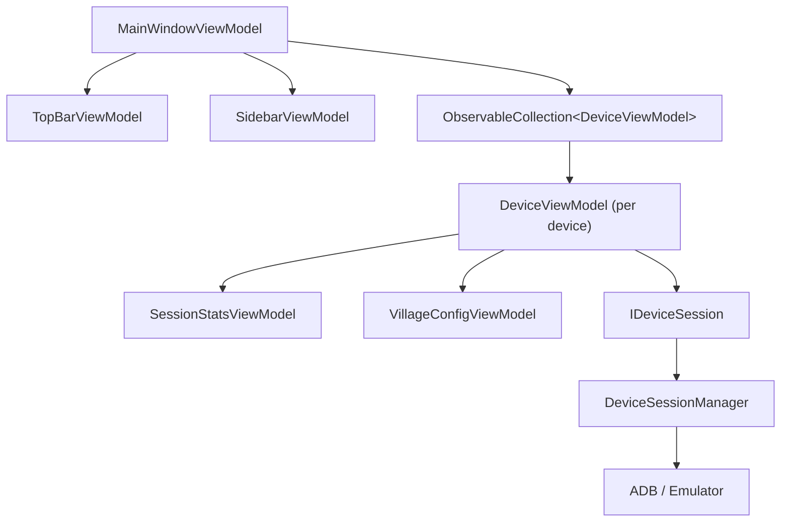

# Đặc Tả Thiết Kế Giao Diện — CoC Auto Bot (Avalonia + C#)

<aside>
🤖

**Dành cho AI agent / developer.** Đây là tài liệu thiết kế giao diện (FE) đầy đủ cho phần mềm tự động hóa Clash of Clans. Đọc xong file này là đủ để bắt tay implement mà không cần hỏi lại. Stack: **Avalonia UI (.NET) + MVVM** cho front-end, **C#** cho back-end. Nguyên tắc xuyên suốt: **thiết kế multi-device-ready ngay từ đầu dù khởi điểm chỉ chạy 1 thiết bị.**

</aside>

## 0. TL;DR cho agent

- Mọi state runtime (status, stats, logs, acc đang chạy) **phải gắn với `DeviceId`**. Không có biến runtime toàn cục dạng singleton.
- UI lõi là **`DevicePanelView`** + **`DeviceViewModel`**. Chế độ đơn = render 1 panel; chế độ lưới = `ItemsControl` render nhiều panel. **Không sửa view khi lên multi-device.**
- Có **TopBar điều khiển live luôn hiển thị** (Start All / Stop All / trạng thái tổng).
- Có **Dashboard tổng quan** làm màn hình mặc định (đối thủ AutoCOC không có).
- Giữ nguyên **tính năng nghiệp vụ** của AutoCOC, chỉ làm lại **cách tổ chức & luồng UI**.

---

## 1. Mục tiêu thiết kế

| Mục tiêu | Vì sao |
| --- | --- |
| Multi-device-ready | Đối thủ chỉ chạy 1 giả lập tại 1 thời điểm. Đây là lợi thế cạnh tranh chính. |
| Dashboard tổng quan | Đối thủ mở thẳng vào tab cài đặt, không có màn hình trạng thái. |
| Điều khiển live luôn hiện | Đối thủ nhét nút chạy trong 1 tab riêng ("Run") gây lặp thao tác. |
| Onboarding bằng wizard | Đối thủ bắt người dùng tự cấu hình 1600x900/240dpi/ADB rất khó. |
| Tách lớp giao tiếp BE rõ ràng | Mỗi thiết bị 1 session độc lập để chạy song song. |

---

## 2. Tech stack & thư viện

| Hạng mục | Lựa chọn |
| --- | --- |
| UI Framework | Avalonia UI (.NET) |
| Pattern | MVVM (ViewModel-first) |
| MVVM toolkit | CommunityToolkit.Mvvm (`[ObservableProperty]`, `[RelayCommand]`) |
| DI | Microsoft.Extensions.DependencyInjection |
| Theme | Avalonia Fluent Theme + dark mode |
| Icon | Material.Icons.Avalonia hoặc FluentIcons |
| Realtime BE→FE | `IObservable<T>` / event, marshal về UI bằng `Dispatcher.UIThread.Post` |
| Giao tiếp giả lập | ADB qua lớp `IDeviceSession` (BE) |

---

## 3. Triết lý kiến trúc: "device-scoped by default"

**Quy tắc vàng:** trước khi đặt bất kỳ state nào, tự hỏi *"Cái này có nhân lên theo số thiết bị không?"*

- **Có** → đặt trong `DeviceViewModel` (scoped theo `DeviceId`).
- **Không** → đặt ở app-level (global).

### Phân loại state

| Loại | Ví dụ | Nơi lưu |
| --- | --- | --- |
| Global (app-level) | Theme, ngôn ngữ, danh sách config đã lưu, cài đặt chung | `AppStateService` |
| Device-scoped | Status, acc đang chạy, stats phiên, logs, giả lập đang chọn, config đang áp | `DeviceViewModel` |

### ❌ Anti-pattern phải tránh

```csharp
// SAI: state phẳng, ngầm định chỉ 1 thiết bị → không thể scale
public BotStatus Status { get; set; }
public Account CurrentAccount { get; set; }
public SessionStats Stats { get; set; }
```

### ✅ Pattern đúng

```csharp
// ĐÚNG: mọi runtime state nằm trong DeviceViewModel, quản lý theo collection
public ObservableCollection<DeviceViewModel> Devices { get; }
```

---

## 4. Sơ đồ tổng thể (Shell layout)

```
┌──────────────────────────────────────────────────────────────┐
│ TopBar (LUÔN HIỆN ở mọi trang)                               │
│ [▶ Start All] [⏸ Pause All] [■ Stop All]  ● 2/3 chạy  ⚙ 🌙 VI │
├────────────┬─────────────────────────────────────────────────┤
│ Sidebar    │  Vùng nội dung (đổi theo điều hướng)            │
│            │                                                 │
│ 🏠 Tổng quan│                                                 │
│ ⚙️ Cài đặt  │                                                 │
│ 👥 Tài khoản│              CurrentPage ContentControl          │
│ 🔧 Nâng cao │                                                 │
│ 📋 Nhật ký  │                                                 │
│ ─────────── │                                                 │
│ THIẾT BỊ:   │                                                 │
│ ● Emu-5554  │                                                 │
│ ● Emu-5556  │                                                 │
│ ○ Emu-5558  │                                                 │
│ + Thêm máy  │                                                 │
└────────────┴─────────────────────────────────────────────────┘
```

- **TopBar**: điều khiển toàn cục + trạng thái tổng + theme/ngôn ngữ.
- **Sidebar (SplitView.Pane)**: nav chính ở trên, danh sách thiết bị ở dưới (chấm màu = trạng thái).
- **Content**: `ContentControl` bind tới `CurrentPage`.

---

## 5. Cấu trúc thư mục project

```
/CocBot.App            (Avalonia FE)
├── App.axaml / App.axaml.cs
├── ViewLocator.cs          // map XxxViewModel -> XxxView
├── /Views
│   ├── MainWindow.axaml
│   ├── /Shell
│   │   ├── TopBarView.axaml
│   │   └── SidebarView.axaml
│   ├── /Dashboard
│   │   ├── DashboardView.axaml
│   │   ├── DevicePanelView.axaml      // ⭐ tái dùng cho single & grid
│   │   └── DeviceListItemView.axaml
│   ├── /Settings
│   │   ├── SettingsView.axaml
│   │   ├── MainVillageView.axaml
│   │   ├── NightVillageView.axaml
│   │   └── ClanGamesView.axaml
│   ├── /Accounts
│   │   └── AccountsView.axaml
│   ├── /Advanced
│   │   ├── AdvancedView.axaml
│   │   └── CoordinateEditorView.axaml
│   └── /Logs
│       └── LogsView.axaml
├── /ViewModels
│   ├── MainWindowViewModel.cs
│   ├── /Shell (TopBarViewModel, SidebarViewModel)
│   ├── /Dashboard (DashboardViewModel, DeviceViewModel, SessionStatsViewModel)
│   ├── /Settings (...)
│   ├── /Accounts (AccountsViewModel, AccountItemViewModel)
│   └── /Advanced (AdvancedViewModel, CoordinateEditorViewModel)
├── /Services
│   ├── AppStateService.cs       // global state
│   ├── IDeviceSession.cs        // 1 phiên / 1 thiết bị
│   ├── DeviceSessionManager.cs  // quản lý nhiều session
│   ├── IConfigStore.cs          // load/save config (profile)
│   └── IEmulatorDiscovery.cs    // dò giả lập + ADB
└── /Models
    ├── Device.cs, BotStatus.cs, SessionStats.cs
    ├── VillageConfig.cs, AttackConfig.cs, WallUpgradeConfig.cs
    └── Account.cs, SpellCoordinate.cs, DelayConfig.cs
```

---

## 6. Cây ViewModel (chuẩn để code theo)

```
MainWindowViewModel
├── TopBarViewModel                       // Start/Stop All, RunningSummary, theme, lang
├── SidebarViewModel                      // NavItems, SelectedNav, Devices (ref)
├── ObservableCollection<DeviceViewModel> Devices   // ⭐ NGUỒN SỰ THẬT
├── DeviceViewModel? ActiveDevice         // thiết bị đang xem (chế độ đơn)
├── bool IsGridMode                       // toggle Single / Grid
└── object CurrentPage                    // trang đang hiển thị

DeviceViewModel                           // 1 instance / 1 thiết bị
├── string DeviceId                       // vd "emulator-5554"
├── string DisplayName
├── BotStatus Status                      // Idle | Running | Paused | Error | Offline
├── SessionStatsViewModel Stats
├── ObservableCollection<LogEntry> Logs   // buffer log RIÊNG từng máy
├── VillageConfigViewModel MainVillage
├── VillageConfigViewModel NightVillage
├── ClanGamesConfigViewModel ClanGames
├── AccountSwitchConfigViewModel AccountSwitch
├── IDeviceSession Session                // lớp giao tiếp BE
├── RelayCommand StartCommand
├── RelayCommand PauseCommand
├── RelayCommand ResumeCommand
└── RelayCommand StopCommand

SessionStatsViewModel
├── int TotalBattles
├── int Star0 / Star1 / Star2 / Star3
├── int WallsUpgraded
├── int ClanGamesPoints
├── int ClanGamesTasksDone
└── long LootGold / LootElixir / LootDarkElixir
```

### Sơ đồ quan hệ (mermaid)



---

## 7. Các màn hình chi tiết

### 7.1. Shell + TopBar

**Chức năng TopBar:**

- `Start All` / `Pause All` / `Stop All`: lặp qua `Devices` gọi command tương ứng.
- `RunningSummary`: text dạng "2/3 chạy" = số device Status == Running / tổng.
- Toggle theme (sáng/tối), chọn ngôn ngữ (VI/EN).

**Hành vi:** TopBar bind vào `TopBarViewModel`, luôn nằm `DockPanel.Dock="Top"`, không bị thay khi đổi trang.

### 7.2. 🏠 Tổng quan (Dashboard) — màn hình mặc định

Có toggle **Single / Grid**:

```
Chế độ:  ( ● Đơn )  ( Lưới )       Thiết bị: [Emu-5554 ▼]

— SINGLE —                          — GRID —
┌───────────────────────────┐      ┌────────┐ ┌────────┐
│ Emu-5554        ● Running  │      │Emu-5554│ │Emu-5556│
│ Acc: "Farm chính"          │      │● Run   │ │● Run   │
│ Trận: 24 · ⭐ 18/24        │      │18/24   │ │12/20   │
│ Tường: 5 · Loot: 2.4M      │      │[▶][⏸][■]│ │[▶][⏸][■]│
│ [▶][⏸][■]                  │      └────────┘ └────────┘
│ ── Logs live ──            │      ┌────────┐ ┌────────┐
│ ...                        │      │Emu-5558│ │+ Thêm  │
└───────────────────────────┘      └────────┘ └────────┘
```

**Mỗi ô đều là `DevicePanelView`** (single = bản đầy đủ; grid = bản thu gọn qua DataTrigger/Class theo `IsGridMode`). Card hiển thị: tên thiết bị, chấm trạng thái, acc đang chạy, số trận + sao, loot, nút điều khiển, mini-log.

### 7.3. ⚙️ Cài đặt (Settings)

Tab phụ bên trong: **Làng Chính / Làng Đêm / Trò Chơi Hội**. Áp cho `ActiveDevice` (hoặc "áp cho tất cả" qua nút).

**Làng Chính (`MainVillageView`):**

- Chế độ tấn công: `Tấn công (Attack)` | `Auto Donate` (đã bỏ Đấu RANK theo yêu cầu sản phẩm).
- Combo lính: `Rồng` | `Rồng Điện`.
- Ngưỡng tài nguyên: **đề xuất cải tiến** — chọn chế độ lọc `Theo tổng` (1 ô gộp Vàng+Dầu Tím) hoặc `Theo từng loại` (tách riêng), kèm logic AND/OR. Dầu Đen có ô riêng.
- Farm & xin lính: dùng xin lính / bánh kem / lính khác.
- Nâng Tường tự động: ngưỡng Vàng, ngưỡng Dầu Tím, số trận/lần, loại tài nguyên.
- Đầu hàng thông minh: theo ngưỡng tài nguyên còn lại / theo thời gian (giây).

**Làng Đêm (`NightVillageView`):**

- Chế độ: `Chỉ farm Dầu (hạ cúp)` | `Farm Vàng & Dầu (đẩy cúp)` | `Tự động`.
- Cài đặt cúp (chế độ tự động): Cúp tối đa / Cúp tối thiểu.
- Nâng Tường Làng Đêm (tương tự Làng Chính).

**Trò Chơi Hội (`ClanGamesView`):**

- Chọn làng nhận nhiệm vụ: Cả hai / Làng Chính / Làng Đêm.
- Bộ lọc >150 nhiệm vụ: danh sách tick chọn + nút lưu.

### 7.4. 👥 Tài khoản (Accounts)

- Danh sách acc: tên hiển thị, config gắn kèm, làng mục tiêu, ngưỡng điểm Trò Chơi Hội.
- Thêm acc: chụp màn hình giả lập → kéo chọn vùng TÊN acc → nhập tên → gắn config → chọn làng.
- Cấu hình auto đổi acc: sau X trận / X phút / X điểm Trò Chơi Hội.
- Sửa / xóa acc.

### 7.5. 🔧 Nâng cao (Advanced)

- Toggle "Dùng cấu hình mặc định".
- Delay: thả quân, thả Băng, Đại Quản Giáo, Cuồng Nộ sau (đơn vị ms).
- **Coordinate Editor** (`CoordinateEditorView`): chọn config → chọn góc nhìn (Trên/Dưới) → chọn loại phép (Cuồng Nộ đầu / Đóng Băng / Cuồng Nộ sau) → click trên ảnh base để đánh dấu → lưu. Hỗ trợ Undo/Clear. 4 hướng tấn công × 3 loại tọa độ.

### 7.6. 📋 Nhật ký (Logs)

- Mỗi thiết bị có buffer log riêng. Có filter theo mức (Info/Warning/Error) và theo thiết bị.
- Realtime, auto-scroll, nút copy/export.

### 7.7. Quản lý cấu hình (Profile) — KHÔNG làm tab riêng

- Đối thủ để "Lưu" thành 1 tab. Ở đây biến thành **dropdown profile + nút lưu ở góc TopBar/Settings**: chọn config, lưu mới, cập nhật, xóa. Giảm 1 tab thừa.

### 7.8. Setup Wizard (lần chạy đầu)

Flow: chọn giả lập → tự dò độ phân giải/dpi → cảnh báo nếu khác 1600x900/240dpi → hướng dẫn bật ADB → chạy thử 1 trận → xong. Đây là điểm onboarding vượt đối thủ.

---

## 8. Lớp giao tiếp BE (multi-device cốt lõi)

```csharp
public interface IDeviceSession
{
    string DeviceId { get; }
    BotStatus Status { get; }

    Task StartAsync(VillageConfig config, CancellationToken ct);
    Task PauseAsync();
    Task ResumeAsync();
    Task StopAsync();

    // Realtime đẩy về FE
    IObservable<BotStatus> StatusChanged { get; }
    IObservable<LogEntry> LogReceived { get; }
    IObservable<SessionStats> StatsUpdated { get; }
}

public interface IDeviceSessionManager
{
    IReadOnlyList<IDeviceSession> Sessions { get; }
    IDeviceSession GetOrCreate(string deviceId);
    Task StartAllAsync();
    Task StopAllAsync();
}
```

**Quy tắc:**

- 1 thiết bị = 1 `IDeviceSession` độc lập (1 kết nối ADB, 1 luồng event riêng).
- ViewModel **không gọi ADB trực tiếp** — chỉ qua `IDeviceSession`.
- Mọi event realtime phải `Dispatcher.UIThread.Post(...)` trước khi cập nhật ObservableProperty.
- Nếu sau này dùng WebSocket/IPC, mỗi message **bắt buộc kèm `DeviceId`** để route về đúng `DeviceViewModel`.

---

## 9. XAML mẫu

### 9.1. MainWindow (Shell)

```xml
<DockPanel>
  <Border DockPanel.Dock="Top" Classes="topbar">
    <StackPanel Orientation="Horizontal" Spacing="8">
      <Button Command="{Binding TopBar.StartAllCommand}" Content="▶ Start All"/>
      <Button Command="{Binding TopBar.PauseAllCommand}" Content="⏸ Pause All"/>
      <Button Command="{Binding TopBar.StopAllCommand}"  Content="■ Stop All"/>
      <TextBlock VerticalAlignment="Center"
                 Text="{Binding TopBar.RunningSummary}"/>
    </StackPanel>
  </Border>

  <SplitView IsPaneOpen="True" DisplayMode="Inline" OpenPaneLength="220">
    <SplitView.Pane>
      <DockPanel>
        <ListBox DockPanel.Dock="Top"
                 ItemsSource="{Binding Sidebar.NavItems}"
                 SelectedItem="{Binding Sidebar.SelectedNav}"/>
        <Separator DockPanel.Dock="Top"/>
        <ItemsControl ItemsSource="{Binding Devices}">
          <ItemsControl.ItemTemplate>
            <DataTemplate>
              <ContentControl Content="{Binding}"/> <!-- DeviceListItemView -->
            </DataTemplate>
          </ItemsControl.ItemTemplate>
        </ItemsControl>
      </DockPanel>
    </SplitView.Pane>

    <ContentControl Content="{Binding CurrentPage}"/>
  </SplitView>
</DockPanel>
```

### 9.2. Dashboard — Single vs Grid (chỉ khác container)

```xml
<Panel>
  <!-- GRID MODE -->
  <ScrollViewer IsVisible="{Binding IsGridMode}">
    <ItemsControl ItemsSource="{Binding Devices}">
      <ItemsControl.ItemsPanel>
        <ItemsPanelTemplate>
          <UniformGrid Columns="2"/>
        </ItemsPanelTemplate>
      </ItemsControl.ItemsPanel>
      <ItemsControl.ItemTemplate>
        <DataTemplate>
          <ContentControl Content="{Binding}"/> <!-- ⭐ DevicePanelView -->
        </DataTemplate>
      </ItemsControl.ItemTemplate>
    </ItemsControl>
  </ScrollViewer>

  <!-- SINGLE MODE -->
  <ContentControl Content="{Binding ActiveDevice}"
                  IsVisible="{Binding !IsGridMode}"/>
</Panel>
```

### 9.3. DevicePanelView (lõi tái dùng)

```xml
<Border Classes="device-card">
  <StackPanel Spacing="6">
    <DockPanel>
      <Ellipse Classes="status-dot" Classes.running="{Binding IsRunning}"/>
      <TextBlock Text="{Binding DisplayName}" FontWeight="Bold"/>
      <TextBlock Text="{Binding Status}" DockPanel.Dock="Right"/>
    </DockPanel>
    <TextBlock Text="{Binding CurrentAccountName, StringFormat='Acc: {0}'}"/>
    <TextBlock Text="{Binding Stats.Summary}"/> <!-- "24 trận · 18/24 ⭐" -->
    <StackPanel Orientation="Horizontal" Spacing="4">
      <Button Command="{Binding StartCommand}"  Content="▶"/>
      <Button Command="{Binding PauseCommand}"  Content="⏸"/>
      <Button Command="{Binding StopCommand}"   Content="■"/>
    </StackPanel>
  </StackPanel>
</Border>
```

### 9.4. ViewLocator (map VM → View)

```csharp
public class ViewLocator : IDataTemplate
{
    public Control Build(object? data)
    {
        var name = data!.GetType().FullName!
            .Replace("ViewModel", "View", StringComparison.Ordinal);
        var type = Type.GetType(name);
        return type != null
            ? (Control)Activator.CreateInstance(type)!
            : new TextBlock { Text = "Not Found: " + name };
    }
    public bool Match(object? data) => data is ViewModelBase;
}
```

---

## 10. Luật "multi-device-ready" (bắt buộc tuân thủ)

```
[MUST]  Mọi runtime state nằm trong DeviceViewModel, key theo DeviceId.
[MUST]  DevicePanelView không nhận DeviceId qua prop xuyên tầng — lấy từ DataContext.
[MUST]  Component con KHÔNG gọi ADB/BE trực tiếp — chỉ qua IDeviceSession.
[MUST]  Mỗi thiết bị 1 buffer Logs riêng (không gộp chung 1 mảng).
[MUST]  Layout dùng container co giãn (UniformGrid/WrapPanel) — không hardcode full viewport.
[MUST]  Mọi event realtime marshal qua Dispatcher.UIThread trước khi set property.
[SHOULD] Routing/URL phản ánh được nhiều thiết bị (device/:id và devices).
[SHOULD] Có 'Start All / Stop All' ở TopBar ngay từ đầu.
[AVOID] Singleton ViewModel cho status/stats/logs.
[AVOID] Bind cứng vào 1 thiết bị duy nhất ở bất kỳ View nào.
```

---

## 11. Quy ước đặt tên (naming conventions)

- View ↔ ViewModel: `XxxView.axaml` ↔ `XxxViewModel.cs` (để ViewLocator tự map).
- Command: hậu tố `Command` (`StartCommand`), sinh bằng `[RelayCommand]`.
- Observable property: dùng `[ObservableProperty]` field `camelCase` → tự sinh property `PascalCase`.
- Service: interface `IXxxService` / `IXxx`, impl `Xxx`.
- Model thuần (DTO/POCO) tách khỏi ViewModel.

---

## 12. Bản đồ tính năng từ đối thủ (AutoCOC)

| Tính năng AutoCOC | Giữ? | Ghi chú |
| --- | --- | --- |
| Làng Chính / Đêm / Trò Chơi Hội | ✅ Giữ | Gom vào trang Cài đặt dạng tab phụ |
| Đấu RANK | ❌ Bỏ | Theo yêu cầu sản phẩm |
| Combo Rồng / Rồng Điện | ✅ Giữ | Cân nhắc thêm combo theo meta |
| Ngưỡng tài nguyên (4 ô) | ✅ Cải tiến | Toggle Theo tổng / Theo loại + AND/OR |
| Nâng Tường tự động | ✅ Giữ |  |
| Đầu hàng thông minh | ✅ Giữ |  |
| Quản lý đa tài khoản | ✅ Giữ |  |
| Delay + tọa độ phép | ✅ Giữ | Đưa vào trang Nâng cao |
| Lưu cấu hình | ✅ Cải tiến | Bỏ tab riêng → dropdown profile |
| Tab Run riêng | ❌ Thay | Bằng TopBar live + Dashboard |
| Chạy 1 giả lập | ❌ Thay | Bằng kiến trúc multi-device |
| (mới) Dashboard tổng quan | ➕ Thêm | Đối thủ không có |
| (mới) Setup Wizard | ➕ Thêm | Đối thủ không có |
| (mới) Thông báo Telegram/Discord | ➕ Thêm (sau) | Lợi thế cho dân cày |

---

## 13. Lộ trình triển khai (phân pha)

```
Phase 1 — Khung & 1 thiết bị (nhưng kiến trúc multi-ready)
  - Shell: TopBar + Sidebar + ContentControl + ViewLocator
  - DeviceViewModel + DevicePanelView (single mode)
  - IDeviceSession + DeviceSessionManager (1 session)
  - Settings (Làng Chính/Đêm/Hội), Accounts cơ bản

Phase 2 — Vận hành đầy đủ 1 thiết bị
  - Advanced (delay + Coordinate Editor)
  - Logs realtime, Session stats
  - Profile dropdown (load/save config)
  - Setup Wizard

Phase 3 — Multi-device
  - Grid mode (ItemsControl + UniformGrid)
  - Start All / Stop All thực thi song song
  - Quản lý nhiều IDeviceSession đồng thời
  - Lọc log theo thiết bị

Phase 4 — Khác biệt hóa
  - Thông báo Telegram/Discord
  - Dashboard tổng hợp đa máy (loot tổng, uptime)
  - Anti-ban / randomize hành vi
```

---

## 14. Definition of Done (cho agent tự kiểm)

```
[ ] Thêm thiết bị thứ 2 KHÔNG cần sửa DevicePanelView/DeviceViewModel.
[ ] Single ↔ Grid chỉ đổi container bọc ngoài.
[ ] Start All chạy song song nhiều session, mỗi máy log/stats riêng.
[ ] Không có state runtime nào nằm ngoài DeviceViewModel.
[ ] Component không gọi ADB trực tiếp (chỉ qua IDeviceSession).
[ ] Đổi theme/ngôn ngữ áp toàn app, không phá state thiết bị.
```

---

## 15. Hệ thống License / Key bản quyền (để bán)

<aside>
🔑

**Mục tiêu:** user bắt buộc nhập key hợp lệ mới dùng được. Giao diện hiển thị **"Còn X ngày"**. Key gắn với máy để chống chia sẻ. Có cơ chế hết hạn + gia hạn.

</aside>

### 15.1. Vị trí trong kiến trúc — License Gate

License là **global state**, kiểm tra **trước khi vào app chính**. App khởi động theo luồng:

```jsx
App khởi động
   │
   ▼
LicenseService.CheckAsync()
   │
   ├── Chưa kích hoạt / Hết hạn / Sai key ──► ActivationView (màn hình nhập key)
   │                                              │ nhập key hợp lệ
   │                                              ▼
   └── Hợp lệ ───────────────────────────────► MainWindow (app chính)
                                                  │
                                                  ▼
                                       TopBar hiển thị badge "Còn X ngày"
```

- `MainWindow` **không bao giờ** được hiển thị nếu license chưa hợp lệ.
- Định kỳ (vd mỗi 6–12h hoặc mỗi lần Start bot) kiểm tra lại; nếu hết hạn giữa chừng → chặn về `ActivationView`.

### 15.2. Data model

```csharp
public enum LicenseStatus
{
    NotActivated,   // chưa nhập key
    Active,         // còn hạn
    Expired,        // hết hạn
    Invalid,        // key sai / bị thu hồi
    MachineMismatch,// key đã dùng ở máy khác
    GracePeriod     // mất mạng, đang dùng tạm offline
}

public sealed class LicenseInfo
{
    public string Key { get; init; }
    public LicenseStatus Status { get; init; }
    public DateTimeOffset? ExpiresAt { get; init; }
    public string MachineId { get; init; }      // vân tay phần cứng
    public DateTimeOffset LastVerifiedAt { get; init; }
    public int DaysRemaining =>
        ExpiresAt is null ? 0
        : Math.Max(0, (int)(ExpiresAt.Value - DateTimeOffset.Now).TotalDays);
}
```

### 15.3. Service

```csharp
public interface ILicenseService
{
    LicenseInfo Current { get; }
    IObservable<LicenseInfo> Changed { get; }   // để TopBar tự cập nhật badge

    Task<LicenseInfo> ActivateAsync(string key);   // gọi server kích hoạt
    Task<LicenseInfo> VerifyAsync();               // kiểm tra định kỳ
    Task DeactivateAsync();                         // gỡ key khỏi máy
    string GetMachineId();                          // sinh vân tay máy
}
```

**Lưu ý triển khai:**

- `MachineId` sinh từ phần cứng (CPU id + ổ cứng + MAC, hash lại). Server gắn key ↔ machineId ở lần kích hoạt đầu → key bị share sang máy khác sẽ `MachineMismatch`.
- Kết quả verify nên **ký số (signature)** từ server; client lưu cache có chữ ký để chống sửa file local.
- Cho phép **grace period** (vd 3 ngày offline) để user mất mạng vẫn dùng được, tránh phiền.

### 15.4. Giao diện

**A. Màn hình kích hoạt (`ActivationView`)** — hiện khi chưa hợp lệ:

```jsx
┌──────────────────────────────────────┐
│            🔑  Kích hoạt              │
│                                      │
│  Nhập key bản quyền để sử dụng:      │
│  ┌────────────────────────────────┐  │
│  │ XXXX-XXXX-XXXX-XXXX            │  │
│  └────────────────────────────────┘  │
│  [ Kích hoạt ]                       │
│                                      │
│  ⚠ Key sai hoặc đã hết hạn           │
│  Mua key: t.me/shop_cua_ban          │
│  Mã máy: A1B2-C3D4 (gửi khi mua)     │
└──────────────────────────────────────┘
```

**B. Badge "Còn X ngày" trên TopBar** — luôn hiện khi đã kích hoạt:

```jsx
[▶ Start All] [⏸] [■ Stop All]  ● 2/3 chạy   🟢 Còn 23 ngày   ⚙ 🌙 VI
```

- 🟢 Xanh: > 7 ngày.
- 🟡 Vàng: ≤ 7 ngày → kèm nút "Gia hạn".
- 🔴 Đỏ: ≤ 2 ngày hoặc đã hết → nhắc mạnh, click mở `ActivationView`.
- Hover badge → tooltip: ngày hết hạn cụ thể + mã máy.

### 15.5. ViewModel

```jsx
LicenseViewModel (gắn vào TopBarViewModel)
├── string StatusText        // "Còn 23 ngày" / "Hết hạn"
├── LicenseBadgeLevel Level  // Green | Yellow | Red
├── DateTimeOffset? ExpiresAt
├── string MachineId
├── RelayCommand RenewCommand      // mở link mua/gia hạn
└── RelayCommand OpenActivationCommand

ActivationViewModel
├── string KeyInput
├── bool IsBusy
├── string? ErrorMessage
├── string MachineId          // để user copy gửi khi mua
└── RelayCommand ActivateCommand
```

### 15.6. Quy tắc bảo mật (chống crack cơ bản)

```jsx
[MUST]  Verify license phía SERVER, không chỉ check local.
[MUST]  Gắn key với MachineId ngay lần kích hoạt đầu.
[MUST]  Kết quả license có chữ ký số; client verify chữ ký.
[SHOULD] Cache license đã ký để hỗ trợ grace period offline.
[SHOULD] Verify lại định kỳ + mỗi lần Start bot.
[SHOULD] Cho phép server thu hồi (revoke) key tức thì.
[AVOID] Lưu trạng thái 'đã kích hoạt' dạng bool plain trong file/registry.
[AVOID] So sánh key bằng hằng số hardcode trong client.
```

### 15.7. Bổ sung vào lộ trình

- **Phase 4 (Khác biệt hóa)**: thêm hạng mục **License/Key system** — `ILicenseService`, `ActivationView`, badge "Còn X ngày", machine binding, server kích hoạt/gia hạn/thu hồi.
- Cân nhắc: gói theo thời hạn (1 tháng) hoặc theo **số thiết bị tối đa** chạy song song (tận dụng chính lợi thế multi-device làm bậc giá).